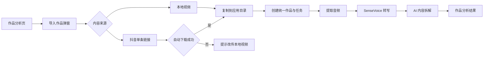

# 手动导入视频并自动拆解设计

## 背景与目标

抖音登录与自动采集可能因平台风控暂时不可用。产品需要一条不依赖博主主页登录的替代路径，让用户可以导入电脑中的视频，或粘贴单条抖音视频链接，并继续使用现有的本地转写与 AI 内容拆解能力。

成功标准：用户从“作品分析”页面发起导入后，无需停留等待；应用自动完成媒体准备、音频提取、文字转写和 AI 拆解，并把可重试的处理状态与最终结果展示在作品列表中。

## 已确认的产品决策

- 同时支持本地视频文件和单条抖音视频链接。
- 导入作品可以关联已有博主，也可以归入“未分类作品”。
- 抖音链接无法下载时不尝试外部工具或绕过平台限制，提示用户改传本地视频。
- 入口位于“作品分析”页右上角的“导入作品”按钮，点击后打开弹窗；不新增侧栏导航。
- 导入后自动完成转写和 AI 拆解，不设置人工确认文字稿的阻塞步骤。
- 本地视频复制到应用管理目录，并遵循现有媒体保留天数自动清理。
- 重复内容不重复处理，直接打开原分析结果。

## 用户流程

1. 用户进入“作品分析”，点击“导入作品”。
2. 用户选择“本地视频”或“抖音链接”。
3. 用户可选关联博主；默认是“未分类作品”。
4. 本地视频通过拖放或文件选择器导入；抖音来源只接受单条视频 URL，不接受博主主页 URL。
5. 应用先执行重复检测。存在相同作品时关闭弹窗并打开原结果。
6. 新作品被复制或下载到应用媒体目录，创建统一作品记录和后台处理任务。
7. 弹窗关闭，作品列表实时显示当前阶段；用户可以继续使用其他页面。
8. 应用依次提取音频、检查转写模型、生成文字稿并执行 AI 拆解。
9. 完成或失败时发送桌面通知；用户从作品列表打开结果或从失败阶段重试。

## 界面设计

### 导入弹窗

- 顶部使用“本地视频 / 抖音链接”两个来源选项卡。
- 本地视频状态提供拖放区和文件选择按钮，第一版接受 MP4、MOV、MKV 和 WebM。
- 抖音链接状态提供单行 URL 输入框。
- “关联博主”是可选下拉框，首项为“未分类作品”。
- 主操作按钮为“开始分析”。提交成功后立即关闭弹窗。
- 文件类型、URL 格式等可同步验证的问题直接显示在对应字段下方。

### 作品列表状态

新任务立即出现在作品列表。状态顺序为：

1. 正在复制或下载
2. 正在提取音频
3. 正在准备转写模型
4. 正在生成文字稿
5. 正在 AI 拆解
6. 已完成或失败

列表显示阶段名称和可用进度，不伪造无法测量的百分比。模型文件下载和媒体下载使用真实字节进度；FFmpeg、转写和 AI 请求只显示阶段型进度。

### 链接下载失败

弹窗保留用户已经填写的博主归属，显示“无法获取这个视频。请先保存视频到电脑，再从本地上传”，并提供“改为上传本地视频”按钮。切换后直接打开文件选择器。

## 架构与数据流

采用“来源适配器 + 统一处理流水线”，不建立第二套手动分析逻辑。

- `LocalFileImportSource`：验证文件、计算文件指纹、检查空间并复制到媒体目录。
- `DouyinUrlImportSource`：校验单条视频 URL、提取平台视频 ID，并尝试获得公开媒体；失败时返回可操作错误。
- `ImportService`：执行判重、创建作品与处理任务，并把规范化媒体路径交给现有流水线。
- 现有媒体、SenseVoice 和 AI 服务继续负责音频提取、转写和拆解。
- 数据库中的作品增加来源类型、来源键、本地媒体路径和可空博主关联；处理任务继续作为阶段与重试状态的事实来源。

本地文件使用内容哈希作为来源键；抖音链接使用规范化平台视频 ID。作品去重以来源类型与来源键的唯一组合为准。若同一抖音视频先通过链接失败、后通过本地文件导入，因为无法可靠证明两者相同，第一版将其视为不同来源；用户可以删除不需要的失败记录。

## 错误与重试

- 文件不可读、格式不支持或磁盘空间不足：不创建后台任务，弹窗内直接提示。
- 本地复制、链接下载、FFmpeg、模型准备、转写或 AI 失败：保留作品和失败阶段，记录稳定错误码与用户可读信息。
- AI Key 无效、额度不足或服务不可用：保留文字稿，从 AI 阶段重试，不重复提取音频或转写。
- 转写失败：保留视频和音频，从转写阶段重试。
- 链接下载受限：提供改传本地视频，不自动调用桌面工具箱。
- 应用重启后，未完成任务恢复为可重试状态；第一版不自动重跑失败任务，避免无限循环与平台风控。

## 文件生命周期

- 导入时把原视频复制到应用媒体目录，避免用户移动源文件导致任务中断。
- 原视频、下载视频和中间 WAV 文件遵循设置中的媒体保留天数。
- 文字稿、AI 拆解结果、错误记录和作品元数据长期保留。
- 清理只处理已完成或明确失败且超过保留期的媒体，不删除运行中的任务文件。

## 通知与可观察性

- 任务提交后在顶部显示“任务已启动，请到作品分析查看进度”。
- 完成和失败发送 Windows 桌面通知；点击通知打开对应作品。
- 业务日志记录作品 ID、来源类型、阶段开始/结束、耗时和错误码，不记录 API Key、完整 Cookie 或手机号。
- “任务记录”后续从真实处理任务读取数据；本功能至少保证作品列表中的实时状态是真实数据，而不是演示数据。

## 测试与验收

自动化测试覆盖：

- 本地文件与抖音单条链接的输入校验。
- 本地文件复制、内容哈希和重复导入。
- 抖音视频 ID 规范化与重复导入。
- 可选博主与“未分类作品”。
- 统一流水线的阶段推进和失败恢复。
- 链接下载失败后切换本地上传。
- AI 阶段失败后重试不重复转写。
- 媒体保留期清理不影响文字稿和分析结果。
- 弹窗、列表状态、错误信息和桌面通知触发。

手动验收使用一个本地视频和一个可公开访问的抖音单条链接。若链接被平台限制，验收其失败引导，不把绕过限制视为成功标准。

## 非目标

- 不接入“抖音运营工具箱”等外部桌面程序。
- 不绕过抖音登录、验证码、风控或访问限制。
- 不在本期实现批量文件导入、文件夹监控、文字稿人工校对流程或自动发布。
- 不在本期完成飞书同步；导入产生的统一作品与分析数据应保持未来可同步的结构。
